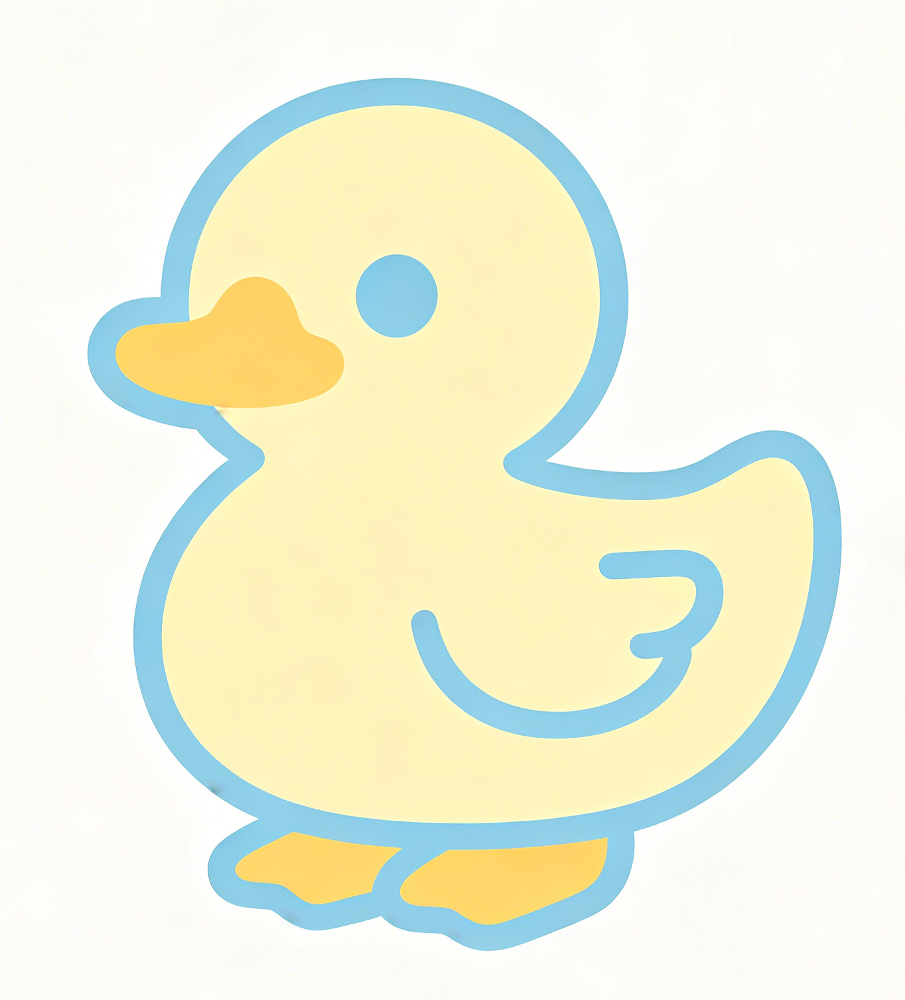
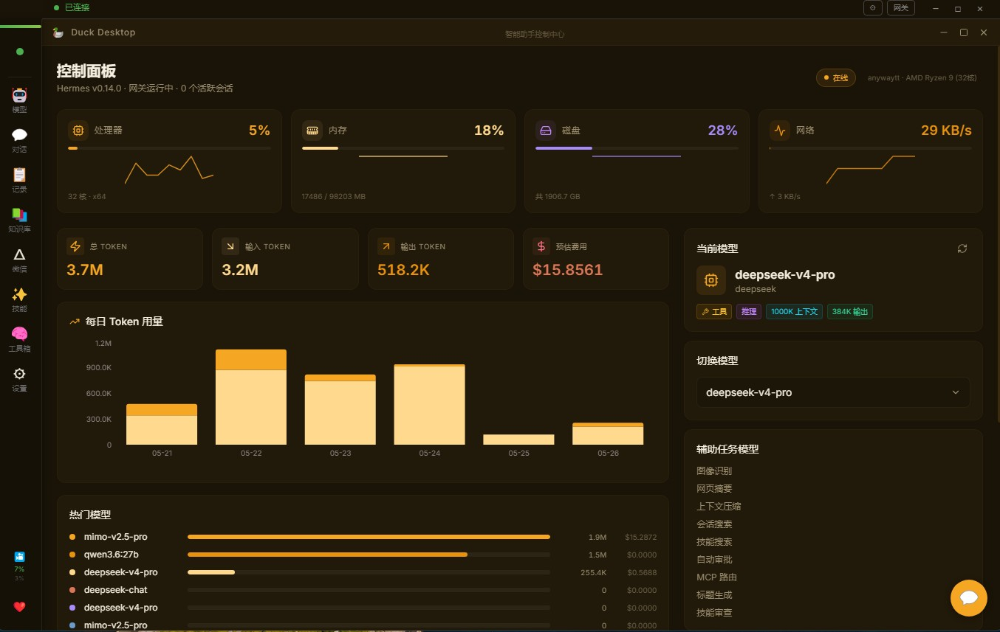
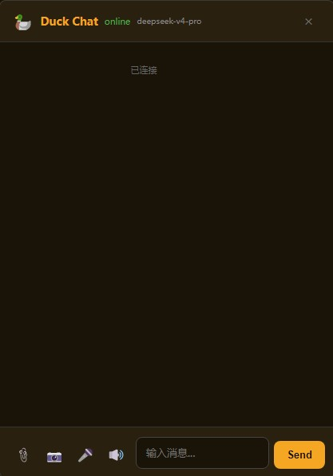
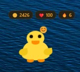

<div align="center">



# 🦆 Duck Desktop

### *让 Hermes 住进你的桌面*

🦆 **Hermes Agent 的专属桌面伴侣** ｜ 桌面宠物 🐣 · AI 记忆系统 🧠 · 智能工具箱 🔧 · 语音交互 🎙️ · 一键启动 ⚡

> 不是替代终端和网页端，是给 Hermes Agent 一个可以住下来的「家」

<br>


<br>

</div>

## 🚀 快速安装

不用拉代码，下载即用 👇

[](https://github.com/anywaytt/Duck-Desktop/releases/download/v1.0.0/Duck-Desktop-V3.zip)

> 解压后直接运行 `Duck Desktop.exe`，无需 Node.js、无需 Python。
>
> 想查看更新或历史版本？👉 [Releases 页面](https://github.com/anywaytt/Duck-Desktop/releases)

---

## 🌟 为什么你需要 Duck Desktop？

命令行很好，但有家的感觉更好。Duck Desktop 不是又一个 AI 聊天窗口——它是 Hermes Agent **真正能住下来的地方**。

一只会卖萌的桌面小鸭 🦆 ｜ 一个懂你的 AI 大脑 🧠 ｜ 一套趁手的工具箱 🔧

---

## ✨ 九大亮点

| | 功能 | 一句话 |
|---|------|--------|
| 🦆 | **桌面宠物** | 浮动小鸭窗口，会饿会开心有衣橱，喊一声「嘿DD」它就醒来 |
| 🧠 | **记忆系统** | AI 记住你的一切，跨会话不脸盲 |
| 🖥️ | **控制面板** | CPU/GPU/内存一目了然，模型随意切换，Token 用量透明 |
| 🔧 | **智能工具箱** | 常用工具一键触达，效率翻倍 |
| 📚 | **知识库管理** | 内置知识检索，想查什么就查什么 |
| 🎙️ | **语音交互** | 动动嘴就能指挥，TTS 语音回你 |
| 📊 | **设备监控** | 实时负载监控，让 AI 帮你盯着电脑 |
| 🔄 | **自动更新** | Hermes 版本检查 + 一键升级，不用操心 |
| ⚡ | **一键启动** | `.bat` 双击——环境检测、服务启动、界面加载，全自动 |

---

## 🎬 快速上手

> 💡 **不想折腾代码？** 直接点上面的大按钮下载 ZIP 就行，解压即用 👆
>
> 以下面向想自己打包、二次开发的用户 ⚙️

```bash
# 克隆项目
git clone https://github.com/anywaytt/Duck-Desktop.git
cd Duck-Desktop

# 安装依赖
npm install

# 启动开发模式（前端 + Electron 同时跑）
npm run dev
```

**一键打包**
```bash
npm run build && npm run build:package
```

启动后双击 `release/Duck Desktop-win32-x64/Duck Desktop.exe`，或者直接双击根目录的 `启动DuckDesktop.bat`，剩下的交给它。

---

## 🏗️ 项目结构速览

```
Duck Desktop/
├── src/                # 🎨 前端界面（React + TypeScript）
│   ├── pages/          #   控制面板、安装引导页
│   ├── components/     #   复用 UI 组件
│   └── hooks/          #   自定义 Hooks
├── electron/           # ⚙️ 主进程（Electron）
│   ├── main.cjs        #   入口
│   ├── preload.cjs     #   桥接层
│   ├── hermes-cli.cjs  #   🧠 与 Hermes Agent 通信
│   ├── pet.html        #   🦆 桌面宠物独立窗口
│   └── inject/         #   注入 Hermes Web UI 的脚本
│       ├── sidebar.js  #   侧边栏
│       ├── knowledge.js#   知识库面板
│       └── ...         #   更多…
└── public/             # 📁 静态资源
```

---

## 📸 界面预览

<div align="center">

| 主界面 | 对话界面 | 桌面宠物 |
|:-------:|:---------:|:---------:|
|  |  |  |

</div>

---

## ⚙️ 技术栈

| 层 | 选型 |
|---|------|
| **前端** | React 19 + TypeScript |
| **构建** | Vite 6（快到飞起） |
| **样式** | Tailwind CSS 3 |
| **桌面** | Electron 28 |
| **图表** | Recharts |
| **图标** | Lucide React |

---

## 🖥️ 系统要求

- **系统**：Windows 10/11 64-bit
- **运行时**：Node.js 18+、Python 3.10+
- **依赖**：已安装并配置好 Hermes Agent

---

## 🦐 关于

Duck Desktop 是大小姐和各大 Agent 一起折腾出来的作品。

不是替代终端和网页端，是给 Hermes Agent 一个可以住下来的「家」。

欢迎星标 ⭐、提 Issue、来 PR，也可以邮箱告知我需要修改的 bug。一起让这只鸭子更可爱 🦆，谢谢各位。

📧 **mail：** `anywaytt@163.com`  
💬 **讨论区：** [Discussions](https://github.com/anywaytt/Duck-Desktop/discussions) — 来聊聊吧  
🐛 **Bug / 需求：** [Issues](https://github.com/anywaytt/Duck-Desktop/issues)

---

## 📜 许可证

[](LICENSE)

本项目采用 **GNU Affero General Public License v3.0 (AGPL-3.0)** 协议，并附加使用限制条款。

简单说：**可以看、可以学、可以改着玩，但禁止闭源、禁止直接拿它卖钱、禁止通过 Web 服务提供而不公开修改。** 详情请见 [LICENSE](LICENSE) 文件。
